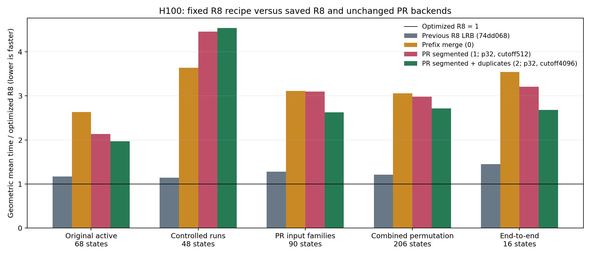
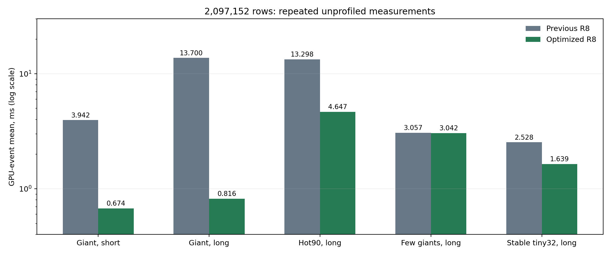

## R8 LRB optimization measurements

The updated R8 recipe is **1.208× faster than saved R8** across 206 active permutation states. Against the unchanged tuned PR #24498 backends, it is **2.982× faster than segmented** and **2.715× faster than segmented + duplicate elimination**. These geometric means describe equally weighted synthetic states; individual cases still favor other algorithms.

### What changed

Only R8 LRB changed. All four proposed directions were explored within it: a second global suffix radix sort for one full-input run, exact tiled duplicate/common-prefix proofs, selective prefix advancement followed by the existing LRB workers, and typed offsets plus a three-way stable warp comparator. Selectors 0/1/2 retain their source and defaults.

The fixed native recipe makes runs longer than 32,768 rows eligible for a proof. Samples gathered during binning decide whether to scan; only an exact scan can skip bytes or declare duplicates. Stable global suffix radix applies only to one non-null run covering the input, equal string lengths and 1–8 bytes remaining. It reuses the first radix pass's key buffers. Other runs keep their original worker sizes and hierarchical finish. Guarded schedule 2 keeps its device-only comparison path and does not use the new proof/radix shortcuts.

Always scanning eligible runs caused confirmed regressions on short-prefix inputs. Sampling during the existing binning pass removed unnecessary proof allocations and launches. The threshold and comparison controls were tested as prototypes; they are not runtime controls in the published source. The cleaned lower-threshold candidate was rejected after a confirmed 4.3% regression on the 262K-row cardinality-64 case. The conservative threshold was checked again before its full matrix. Prototype and failed-confirmation data remain in the linked archive.

### Matched measurement setup

- NVIDIA H100 SXM 80GB, CUDA 13.3; serialized GPU workloads.
- Source `69e33b51c75458080c6077f527c5345242e35fec`; exact source and binary hashes are in [provenance](provenance.json). Saved R8 control: `74dd068d7b819abc307eed2bbe607856d68b2b8e`. Reference PR #24498: `a257d75a7b5a4bb5b4ee392861d8d466e950d297`.
- One benchmark binary and deterministic inputs; the saved library is preloaded for the control. Each state/configuration uses three randomly ordered, freshly warmed processes, five warmups and 20 samples. Tables use the median of three unprofiled GPU-event means. Profile timings never enter rankings.
- 232 primary states × five backends, plus 40 separate stable ascending/descending warp states × two R8 versions: **3,720 measured process/state means**. PR mode 1 uses precision 32/cutoff 512; mode 2 uses precision 32/cutoff 4096. Both are the previously selected fixed recipes.
- All final point regressions above 2%, plus the prototype's flagged cardinality case, received five fresh randomized process pairs of 50 samples. Acceptance requires a median regression no greater than 2%, or a paired process-level 95% log-ratio interval including 1.0. This interval uses process means, not the within-process NVBench sample deviation. The primary matrix is retained unchanged; [rechecks](final-recheck/statistical-gate.csv) are separate.

### Aggregate GPU time

Ratios are **backend time / optimized R8 time**; above 1 favors optimized R8.

| Pool | States | Previous R8 / new R8 | Prefix / new R8 | Segmented / new R8 | Segmented + duplicates / new R8 |
|---|---:|---:|---:|---:|---:|
| Original active | 68 | 1.167 | 2.635 | 2.133 | 1.970 |
| Controlled runs | 48 | 1.144 | 3.637 | 4.465 | 4.542 |
| PR input families | 90 | 1.277 | 3.112 | 3.098 | 2.630 |
| Combined permutation | 206 | 1.208 | 3.055 | 2.982 | 2.715 |
| End-to-end | 16 | 1.449 | 3.544 | 3.209 | 2.680 |

The original active pool excludes identity/constant fast exits; the combined pool excludes the 16 end-to-end gathering states. The separate 40-state stable warp pool improves by **1.160×**. All previously published >2% wins against these three references remain wins in the fresh primary matrix; the same check passes against the fresh saved-R8 control. [Per-state preservation data](win-preservation.csv) include both checks.

### Selected cases at 2,097,152 rows

| Input | Previous R8 ms | Optimized R8 ms | Speedup | Peak allocation: previous → new MiB |
|---|---:|---:|---:|---:|
| Giant, short | 3.942 | 0.674 | 5.85× | 72.365 → 72.365 |
| Giant, 64 shared suffix bytes | 13.700 | 0.816 | 16.79× | 72.365 → 72.365 |
| Hot90, 64 shared suffix bytes | 13.298 | 4.647 | 2.86× | 72.365 → 72.365 |
| Few giants, 64 shared suffix bytes | 3.057 | 3.042 | 1.00× | 72.365 → 72.365 |
| Stable tiny32, 64 shared suffix bytes | 2.528 | 1.639 | 1.54× | 72.365 → 72.365 |
| Exact duplicates, 12 bytes | 2.061 | 2.058 | 1.00× | 72.365 → 72.365 |

Allocation counters exclude pre-generated inputs and include the permutation and temporary allocations. Reusing radix key storage avoids adding another whole-column key pair. R8 still uses more workspace than prefix merge; exact-proof records add 16 bytes per eligible run when a promising run is present.

### Profiles and validation

Seven matched cases were profiled for both saved and optimized R8, seven sampled calls each after warmup. CUDA-event timings above are separate from traced kernel sums. The traces identify proof cost, remaining warp/tile/merge work and host waits.

| Profile case | Previous launches / waits | New launches / waits | Previous / new traced kernel ms |
|---|---:|---:|---:|
| giant-long | 39 / 1 | 48 / 2 | 13.698 / 0.716 |
| giant-short | 39 / 1 | 48 / 2 | 3.859 / 0.575 |
| hot90-long | 40 / 1 | 42 / 1 | 13.159 / 4.544 |
| few-giants-long | 34 / 1 | 34 / 1 | 2.974 / 2.978 |
| stable-tiny32-long | 27 / 1 | 27 / 1 | 2.466 / 1.574 |
| logarithmic-long | 34 / 1 | 34 / 1 | 8.298 / 8.266 |
| duplicates12 | 33 / 1 | 33 / 1 | 2.008 / 1.967 |

The giant cases replace tile sorting and hierarchical merging with a second global radix sort. They launch more kernels and add one host wait, but eliminate repeated suffix comparisons. On `giant-long`, the average accumulated onesweep radix-kernel time is 0.395 ms and the exact proof scan is 0.108 ms across seven captured calls. This suggests that radix/extraction traffic is now a useful optimization target for that case. Stable tiny32 keeps 27 launches while its traced kernel time drops from 2.466 to 1.574 ms.

Few-giant, logarithmic and diagnostic duplicate runs at or below the selected threshold retain their comparison finish and show little change. A lower proof threshold may help them, but the tested lower-threshold source failed the regression gate. Safely reducing that overhead is a remaining direction; this PR keeps the validated conservative threshold.

The full sort suite passed for every selector: R8 passed 1,659 tests; selectors 0/1/2 passed 1,658 each, with the R8-only proof test skipped. Guarded R8 passed 44 focused tests including changing-input graph replay. Native proof/suffix-radix and guarded LRB each passed CUDA memcheck, synccheck and racecheck with zero errors/hazards. The seven-architecture build and repository checks passed. [Validation records](final-validation/summary.json).

### Exploration records

The archive retains each stage rather than folding prototype numbers into the final ranking:

| Stage | Purpose |
|---|---|
| `comparison` | Raw/typed offsets and two-way/three-way stable warp comparisons. |
| `proof` | Initial large-run proof and optional second radix pass; rejected regressions. |
| `threshold` | Lower eligibility threshold and an original-comparator fallback. |
| `hint` | Promotion during binning and reuse of radix key storage. |
| `gate-confirmation`, `cardinality-confirmation` | Five-round checks of the promising prototypes. |
| `rejected-8192` | Cleaned lower-threshold source rejected by the final cardinality check. |
| `final-preflight`, `final`, `final-recheck` | Accepted conservative source and its independent checks. |

Prototype flags: `1` typed offsets, `2` three-way stable warp comparisons, `4` exact proof,
`8` optional suffix radix, `16` lower proof threshold; flags are combined by addition.
The initial `proof` stage scans eligible runs before the later promotion guard was added.
These flags do not exist in the published R8 wrapper.

### Data and reproduction

- [Primary medians, ranges, noise and memory](final/timings.csv), [all primary means](final/raw.csv), [exact jobs and settings](final/manifest.json).
- [Primary per-case gate](final/statistical-gate.csv), [five-round confirmation means](final-recheck/raw.csv), [confirmation jobs](final-recheck/manifest.json).
- [Nsight launch/kernel records](final-profiles/kernels.csv) and [profile setup](final-profiles/manifest.json).
- [Exploration measurements](hint/raw.csv), [rejected lower-threshold confirmation](rejected-8192/final-recheck/statistical-gate.csv), and [complete report](optimization-report.md).

Use a fresh process with `LIBCUDF_STRING_SORT_ALGORITHM=3` and native schedule `0`. Keep stable/direction and input axes matched across references. To reproduce the saved-library control, build commit `74dd068` separately and preload that library with the same default-stream shim. The benchmark README documents current commands; the archive contains driver scripts and exact manifests. Historical PR-default screens and the original comparison remain available in the [previous benchmark comment version's archive](https://github.com/bdice/cudf/tree/2cded08a17c85626938c458f41538eced99928bc).
